# JanOS Wi-Fi Analyzer: implementation and compatibility design

Status: implemented in JanOS source on 2026-09-28, pending firmware build and
device validation. This document distinguishes source behavior from hardware
evidence. The Flipper application remains unchanged. The companion Tab5 reader,
transport worker and LVGL analyzer screen are now implemented in the sibling
`M5MonsterC5-Tab5` checkout; see its `docs/wifi-analyzer.md` for usage and validation.

## 1. Outcome and compatibility boundary

Give Tab5 enough information to draw AP signal levels and channel overlap while
preserving the existing Flipper applications. Use a separately invoked `wifi_analyzer`
interface, separate PSRAM result storage, and explicit ownership of the Wi-Fi scan.

This is an AP survey. AP counts and RSSI are not measured spectrum, interference
power, or percentage airtime utilization. Do not manufacture those metrics.

The firmware performs one requested scan per `wifi_analyzer scan` command. Tab5
should request the next scan only after the previous terminal response and a
user-selected delay. The analyzer does not stream unsolicited repeat scans or
replay its cached snapshot to a reconnecting host.

## 2. Evidence from this checkout

Paths below are relative to `ESP32C5`, except the explicitly named sibling apps.
Search by symbol rather than relying on line numbers after implementation.

| Source | Current behavior and consequence |
| --- | --- |
| `main/main.c`: `start_background_scan` | Uses global result flags; resets count before starting an asynchronous active scan. Cannot be reused unchanged for isolated analyzer snapshots. |
| `WIFI_EVENT_SCAN_DONE` handler | Analyzer-owned events are consumed before the legacy branch. Legacy events still update `g_scan_results` and can transition the sniffer. |
| `print_network_csv`, `print_scan_results` | Eight CSV fields, 1-based index, 50 ms pacing per AP, final `Scan results printed.` marker. Keep the legacy serialization and timing unchanged in this feature. |
| `cmd_scan_networks`, `cmd_show_scan_results` | Depend on shared last-scan state. Successful empty automatic scans currently omit the final print marker; fix separately after legacy acceptance testing. |
| `channel_view_publish_counts`, `channel_view_task` | Count primary-channel APs, using 64 stored records; 2 s delay follows each scan. Completion status is not checked before publishing. Keep its wire format; a separate regression-tested fix can address failure handling. |
| `init_psram_buffers` | Existing large collections use `heap_caps_calloc(..., MALLOC_CAP_SPIRAM)`. Analyzer allocations should be lazy rather than increasing mandatory boot allocations. |
| `wait_or_cancel_wifi_scan`, `cmd_stop` | Some current paths clear flags or force-delete tasks after waiting. That is insufficient to prove analyzer buffers and late events are safe to reuse. |
| `ensure_wifi_mode` | Can stop BLE/802.15.4 before switching modes. Analyzer busy checks must run before this function, not after its side effects. |
| `wardrive_task` scan calls near `20418` | Calls the driver directly, including blocking scans and direct record retrieval. Guarding only `start_background_scan` is insufficient. |
| `zig_recon_radio_busy` | Useful inventory of radio users; also audit STA connection and mode-changing paths. |
| `../FLIPPER/Lab_C5.c` | Parses legacy scan text and exact channel-view markers. All serial bytes feed several parsers, so use a distinct analyzer prefix. |
| `../FlipperLight/src/uart_comm.c` | Parses legacy CSV and completion/no-results messages. |
| Tab5 `wifi_scan_task`, `parse_network_line` | Stores at most 50 APs, uses a 30 s timeout, and starts post-scan enrichment. The analyzer needs a separate worker and snapshot model. |

The existing build description identifies ESP-IDF **v6.0.2** at
`C:/esp/v6.0.2/esp-idf`; no build was run to obtain that information.
Its headers show `wifi_event_sta_scan_done_t.number` is `uint8_t` and the driver
scan ID is also 8-bit. Obtain the total using `esp_wifi_scan_get_ap_num(uint16_t*)`
after completion, rather than treating the event count as a complete total.
The bulk records API releases the driver's AP list; retrieval failure needs list
cleanup. See the [ESP-IDF v6.0.2 Wi-Fi API](https://docs.espressif.com/projects/esp-idf/en/v6.0.2/esp32c5/api-reference/network/esp_wifi.html).

The same local headers provide channel bitmaps, secondary-channel information,
AP bandwidth and VHT center-channel fields. The C adapter maps these fields and
normalizes inconsistent geometry to unknown. Their presence does not establish
that every field is populated correctly on C5 for every AP mode, so capabilities
advertise `width_metadata=sdk_unverified`.

## 3. Explicit legacy invariants

When the analyzer is not active:

- `scan_networks`, `show_scan_results`, `channel_view`, `select_networks`, and
  universal `stop` keep their current invocation and response contracts.
- Do not append columns to legacy CSV, rename markers, change index numbering,
  remove pacing, change the global `MAX_AP_CNT`, or emit analyzer replies.
- Keep `g_scan_results`, count/done/status flags, selected indices, selected
  BSSIDs, sniffer transitions and existing scan timing settings in their legacy domain.
- Do not modify the old country configuration, saved scan settings or NVS defaults
  as a side effect of the new feature.

While the analyzer is active, conflicting operations receive a busy response
before modifying radio or legacy state. Once it stops, `show_scan_results` must
still show the previous legacy snapshot, with the same selection/index mapping.
Analyzer identities never become `select_networks` indices. Using a plotted AP
for a legacy action requires a new legacy scan and BSSID-based reconciliation.

The compatibility target is source apps in both `FLIPPER` and `FlipperLight` plus
the existing Tab5 scan page. Python and C harness checks cannot certify those
applications or the timing behavior of real UART hardware.

## 4. Architecture and ownership

Implemented modules and integration points:

| Module | Responsibility |
| --- | --- |
| `main/wifi_analyzer_core.h/.c` | Option parsing, channel/geometry validation, deadline calculation, and bounded WFA/1 record formatting without ESP-IDF dependencies. |
| `main/wifi_analyzer.h/.c` | Lazy PSRAM buffers, one-shot worker, ESP-IDF scan integration, control replies, serialized line output, and cancellation. |
| `main/main.c` | CLI registration, recursive command-dispatch mutex, early event routing, radio admission checks, first-time STA initialization, and universal-stop integration. |

The recursive dispatch mutex serializes admission for registered commands,
including boot-script commands. Ordinary handlers reserve an in-flight slot and
then release the mutex while running, so concurrent `stop` remains usable.
Analyzer handlers retain the admission lock and refuse to start while an ordinary
handler is still in flight. Analyzer state has its own critical-section lock,
independent of `applicationState` and `operation_stop_requested`. While active,
the dispatcher permits `wifi_analyzer`, `stop`, `show_scan_results`, and `reboot`;
the built-in `help` command is also available. Other registered commands receive
a `[WFACTL1]` busy error before their handlers run. The event handler consumes
analyzer-owned scan completions before legacy state or output changes.

Admission sequence:

1. Parse and validate all options without changing radio state.
2. Under the command-dispatch mutex, reject in-flight ordinary handlers and
   check existing radio users, background workers, transfers and active STA
   connection through the host admission hook. A legacy asynchronous scan stays
   pending until its complete `WIFI_EVENT_SCAN_DONE` callback drains, even if
   legacy timeout or stop code clears its public flags first.
3. Reserve the analyzer owner before lazy allocation and Wi-Fi initialization.
   Existing legacy-versus-legacy behavior is not restructured by this feature.
4. Allocate buffers transactionally, filter the requested channel plan against
   the driver's current country settings, and save band/channel settings that
   will be changed. First-time initialization uses a separate fallible STA
   initializer without the legacy abort-on-error path or extended-country
   override. Successfully created shared network infrastructure is retained for
   retry; a failed driver cleanup latches `legacy_radio_uncertain` until reboot.
5. Only after admission succeeds, allocate a wire scan ID and emit `begin`.
   A start-API failure after `begin` produces a non-success `end`.

### Event routing and driver memory

At the top of `WIFI_EVENT_SCAN_DONE`, route analyzer-owned or quarantined events
away from the complete legacy branch. The event handler copies status/driver ID
into internal control storage; the worker polls that state. The event handler
performs no UART output, PSRAM allocation, or multi-second wait. Only the worker
retrieves the driver AP list, and ownership remains reserved until cleanup ends.

There is at most one outstanding driver scan. A local generation and the 8-bit
driver ID are diagnostics, not proof that an arbitrary late callback belongs to
the next command. Never start another scan just because a timeout cleared a flag.

On success, fetch the 16-bit total first, then the bounded bulk record list into
the working PSRAM buffer. Check both return codes. A zero-result scan needs an
explicit driver-list cleanup path and a successful empty snapshot. A retrieval
failure invalidates the working snapshot and cleans the list. The driver retains
its own allocations during scanning: moving application arrays to PSRAM does not
guarantee that all scan memory moves out of internal RAM.

### State machine

```mermaid
stateDiagram-v2
    [*] --> Idle
    Idle --> Preparing: admission reserved
    Preparing --> Idle: validation/allocation failure
    Preparing --> Scanning: begin emitted and driver started
    Scanning --> Collecting: matching completion
    Collecting --> Publishing: validated records
    Publishing --> Idle: successful end written and snapshot committed
    Scanning --> Cancelling: stop or deadline
    Collecting --> Cancelling: stop or error
    Publishing --> Cancelling: stop or TX error
    Cancelling --> Idle: driver quiescent; buffers retained for reuse
    Cancelling --> Quarantined: completion/quiescence cannot be proven
    Quarantined --> Idle: delayed completion and confirmed cleanup
```



After `begin`, attempt exactly one terminal record while the transport is usable.
Wire cancellation during publication reports the number of complete AP records
already written and discards that transaction on the host. A failed physical
transport cannot guarantee delivery of `end`; host timeout/disconnect retains its
last complete snapshot.

For a scan deadline, request driver stop and allow a bounded completion/cleanup
window. If quiescence cannot be established, retain the owner and buffers in
`Quarantined`, reject subsequent radio work, and report a fault. A delayed valid
completion may allow cleanup; otherwise require a device restart in v1. Do not
force-delete a task and then free memory still reachable from callbacks. A later
driver-reset recovery path requires a tested event-drain barrier before reuse.

`wifi_analyzer stop` affects only this analyzer and is idempotent. Universal
`stop` joins analyzer shutdown before existing paths tear down its radio.
When the analyzer is unused, universal stop output is unchanged. A quarantined
analyzer stays faulted even if legacy code sets global idle flags.

The analyzer fails closed on two legacy ownership ambiguities. If legacy stop
force-deletes a wardrive task, or a `wifi_connect` command fails or times out,
the analyzer returns `busy` with reason `legacy_radio_uncertain` until reboot.
STA connection attempts are tracked across their driver calls and block analyzer
admission while pending. These limits preserve legacy command behavior while
avoiding a new scan after an unproven driver teardown. A normal legacy
asynchronous scan returns `busy` with reason `legacy_scan_draining` until its
completion callback finishes. A live STA or promiscuous/non-STA radio preflight
returns `busy` with reason `radio_busy`.

## 5. PSRAM and internal-RAM budget

Default capacity: 64 records. Per-command `--limit` is 1..128; legacy remains 64.
Allocate two requested-capacity `wifi_ap_record_t` arrays lazily on admission
using `MALLOC_CAP_SPIRAM | MALLOC_CAP_8BIT`. One is the committed snapshot, the
other is working storage. A later larger request grows both buffers while
preserving the prior good snapshot. Normalize/serialize one AP at a time; there
is no full encoded-response buffer.

Application PSRAM estimate:

```text
2 * requested_capacity * sizeof(wifi_ap_record_t)
where requested_capacity <= 128
```

The source enforces a 192 KiB analyzer-owned PSRAM ceiling and at least 64 KiB
free after allocation. It checks available total and largest free block, then
the actual allocation result. Growth accounts for old and new arrays being live
together. Measure exact allocation and high-water values on target. Reject with
`no_psram` if resources cannot be allocated. Free partial allocations; do not
silently allocate the large arrays in internal RAM or silently shrink capacity.

The worker requests a 6 KiB stack. Its serializer scratch line is at most 1026
bytes including LF/NUL. Task stack and UART timing need target measurement.

On success swap working and committed buffers only after the final
success record is accepted by the local output writer. This is local publication,
not an acknowledgement from Tab5. On failure preserve the committed array.
After `stop`, retain the last snapshot and allocated storage for reuse. An idle
`wifi_analyzer clear` frees both arrays and resets analyzer snapshot metadata.
It returns busy while the worker owns them.

## 6. Scan profiles, channel coverage and metadata

Implemented profiles, applied to each analyzer scan configuration:

| Profile | Mode | Per-channel request |
| --- | --- | --- |
| `quick` | active | minimum 100 ms, maximum 300 ms |
| `detailed` | active | minimum 300 ms, maximum 600 ms |
| `passive` | passive | 600 ms |

These settings do not guarantee discovery completeness or exact cycle time. The
driver deadline is effective channel count times maximum dwell plus 150 ms per
channel and 5 s fixed overhead. The output path has a separate baud-aware
deadline. Both budgets need target validation.

The source uses the installed IDF channel bitmap with `channel=0`; 5 GHz bits
are enum positions, not `1 << channel_number`. It filters the candidate plan
against the current driver country settings. Explicitly disallowed channels
return `unsupported_channel`; implicit candidates are removed. It does not
change country settings. The SDK enum includes 169/173/177, unlike the old
fixed `channel_view` list; driver permission remains decisive.

The `begin.channels` field describes the effective requested plan. A successful
driver scan is not per-channel dwell telemetry. Tab5 may show the requested scope
and results, but must not label absent APs as proof of an interference-free channel.
If exact channel coverage is later required, implement a per-channel survey mode
with independently reported completion rather than inferring it from an empty bin.

The adapter keeps raw RSSI and maps SDK bandwidth, secondary, and VHT center
fields. Its normalizer emits complete geometrically consistent width metadata
or all-null geometry. This is a structural check, not hardware validation of
what each AP advertises. AP-advertised width is not the C5's receive width.
The host reference checks geometry, not local regulatory legality or whether
C5 actually populated those fields.

Use hex for SSID bytes to avoid delimiters, control characters and invalid UTF-8
in transport lines. Preserve up to the SDK-exposed 32 bytes. The scan record has
no explicit SSID length: a bounded first-NUL length cannot preserve an embedded
NUL in a radio SSID. Exact arbitrary-octet SSIDs would require raw IE extraction;
do not claim that capability in v1. No vendor SD lookup in the scan event handler.
PHY flags and auth labels are advertised metadata, not negotiated client rates.

## 7. Transport and Tab5 integration

The wire format is in [wifi-analyzer-protocol.md](wifi-analyzer-protocol.md).
Keep the old command outputs untouched. New data uses `[WFA1]`; control replies
use `[WFACTL1]`. The host subscribes explicitly by calling the new command.

The bounded writer emits one complete record under the stdout stream lock.
Control replies use it too. Debug output can appear between complete records.
The worker checks cancellation and the TX deadline between AP records, then
yields to the scheduler. A blocked VFS write cannot be preempted by this code;
`stop` keeps the owner reserved while the writer is still running.

At 115200 baud, 8N1, a 128-record response with 350-byte lines is roughly 44.8 KB,
or 3.9 s of wire time before overhead. Faster radio scanning does not remove this
limit. Bound the worst case using 1026 bytes including CRLF per line. A suitable
initial host budget is radio deadline + `bytes_max * 10 / baud` + 5 s; USB has its
own measured timeout policy. Do not globally remove the old 50 ms pacing.

The successful `end` is written before the worker releases radio ownership.
A new request immediately after `end` can briefly receive `busy`; the host
should wait at least 100 ms before a repeat and use a bounded retry after idle.
Tab5 keeps one reader per transport and boot. It assembles a working snapshot,
validates ID/sequence/counts, and replaces the visible snapshot only after a valid
success `end`. A valid empty scan clears the view. Errors, truncation and stale
data are distinct UI states. Filters are local; SSID search and security/RSSI
filters do not launch radio work or change legacy indices. Do not start existing
credential/inspect enrichment from the analyzer worker.

Protocol detection starts with `wifi_analyzer caps`. An old firmware may respond
with an unknown-command message; after bounded timeout and drain, Tab5 may fall
back to legacy CSV. Do not repeatedly probe before every scan or assume that no
response means an empty result. The fallback must explicitly handle old empty-scan
termination behavior and show width as unknown.

## 8. Remaining acceptance work

The source implementation needs firmware build and hardware validation. Use
[wifi-analyzer-smoke-test.md](wifi-analyzer-smoke-test.md) when the user later
authorizes those steps. Validate old Flipper parser behavior, empty/failure scans,
legacy scan selection and indices, repeated analyzer stop/clear cycles, PSRAM and
stack high-water marks, UART timing, radio restoration and late completion.
Check 20/40/80/160/80+80 metadata against known AP configurations before
describing SDK width metadata as hardware validated. Unknown width is a valid
result. The separate [Tab5 implementation prompt](wifi-analyzer-tab5-prompt.md)
keeps host integration scoped to the sibling application.

The user's current instruction is **no compilation, firmware build, flash, or
serial/hardware test**. Do not run blanket test discovery in this pass:
`test_artifact_inventory_contract.py` invokes a C compiler. A later agent must
retain this constraint unless the user changes it.

## 9. Executed verification and limits

```powershell
python -B -m unittest tests.test_wifi_analyzer_contract tests.test_wifi_analyzer_integration -v
python -B tools/wifi_analyzer_contract.py tests/fixtures/wifi_analyzer_v1.ndjson
```

On 2026-09-28 the focused Python suites passed **53 tests** (39 wire-contract
tests and 14 source-integration checks). The synthetic
fixture produced `snapshots=1`, `terminals=2`, `errors=0`. The reader covers
fragmented serial delivery, 128-AP snapshots, `found` over 255, strict order,
identity, capacity, duplicate BSSIDs, geometry, raw SSID bytes, failures and
atomic publication. A C harness has been authored for the platform-independent
core but has not been compiled or run under the user's current constraint.
Neither suite validates the ESP-IDF worker, actual PSRAM behavior, serial timing,
or legacy Flipper compatibility on a device.

`tools/check_wifi_analyzer_syntax.py` also parsed five new C/header/test files
and sixteen modified `main.c` function bodies with zero syntax diagnostics.
It uses Tree-sitter grammar parsing, not a C compiler, preprocessor, type checker
or linker. To repeat that optional check with binary-only Python dependencies:

```powershell
python3 -m pip install --only-binary=:all: --target "$env:TEMP/janos-wfa-parser" tree-sitter==0.26.0 tree-sitter-c==0.24.2
$env:PYTHONPATH = Join-Path $env:TEMP 'janos-wfa-parser'
python3 -B tools/check_wifi_analyzer_syntax.py
```
