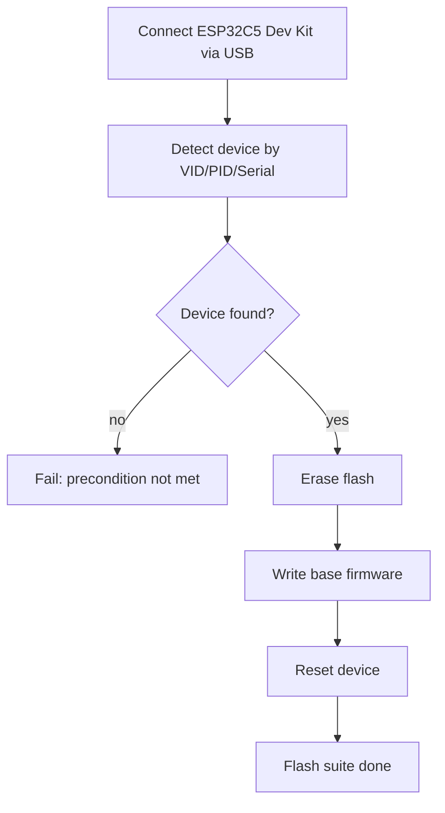

# ESP32C5 tests

## Quick start (flash suite)

1) Put base firmware binaries into `ESP32C5/tools/SW/`:
   - `bootloader.bin`
   - `partition-table.bin`
   - `projectZero.bin`
2) Plug the ESP32C5 DUT (CP2102N) into USB.
3) Run with Docker Compose:

```bash
docker compose -f ESP32C5/tests/docker-compose.yml run --rm tests
```

## Hardware

Primary test device (master):
- ESP32C5 Dev Kit with SD card attached
- Connected to Linux host via USB (CP2102N)

## Flow (current: flash)



## Device configuration

Default detection uses `ESP32C5/tests/config/devices.json` and looks for a
single DUT device by VID/PID/serial. You can override with:

- `ESP32C5_DUT_PORT=/dev/ttyUSB0`
- `ESP32C5_DEVICES_CONFIG=/path/to/devices.json`

## Flash manifest

If base binaries or offsets differ, provide a manifest JSON and optional base
directory:

```json
{
  "files": [
    {"path": "bootloader.bin", "offset": "0x2000"},
    {"path": "partition-table.bin", "offset": "0x8000"},
    {"path": "projectZero.bin", "offset": "0x20000"}
  ]
}
```

Use it with:

```bash
ESP32C5_FLASH_MANIFEST=/workspace/ESP32C5/tests/flash_manifest.json \
ESP32C5_BASE_SW_DIR=/workspace/ESP32C5/tools/SW \
pytest -m flash
```
