# ESP32C5 tests

## Quick start (flash suite)

1) Put base firmware binaries into `ESP32C5/tools/SW/`:
   - `bootloader.bin`
   - `partition-table.bin`
   - `projectZero.bin`
2) Plug the ESP32C5 DUT (CP2102N) into USB.
3) Run with Docker Compose:

```bash
docker compose -f ESP32C5/tests/docker-compose.yml run --rm tests
```

## Alternate runs

Run without pytest-sugar:
```bash
docker compose -f ESP32C5/tests/docker-compose.yml run --rm \
  -e ESP32C5_DUT_PORT=/dev/ttyUSB0 \
  -e PYTEST_ADDOPTS="-p no:sugar" \
  tests
```

Generate HTML report:
```bash
docker compose -f ESP32C5/tests/docker-compose.yml run --rm \
  -e ESP32C5_DUT_PORT=/dev/ttyUSB0 \
  -e PYTEST_ADDOPTS="--html=/workspace/ESP32C5/tests/results/report.html --self-contained-html" \
  tests
```

## After git pull (rebuild image)

If you pulled new changes, rebuild the test image before running:
```bash
docker compose -f ESP32C5/tests/docker-compose.yml build --no-cache tests && \
docker compose -f ESP32C5/tests/docker-compose.yml run --rm \
  -e ESP32C5_DUT_PORT=/dev/ttyUSB0 \
  -e PYTEST_ADDOPTS="--html=/workspace/ESP32C5/tests/results/report.html --self-contained-html" \
  tests
```

## Hardware

Primary test device (master):
- ESP32C5 Dev Kit with SD card attached
- Connected to Linux host via USB (CP2102N)

## Flow (current: flash)

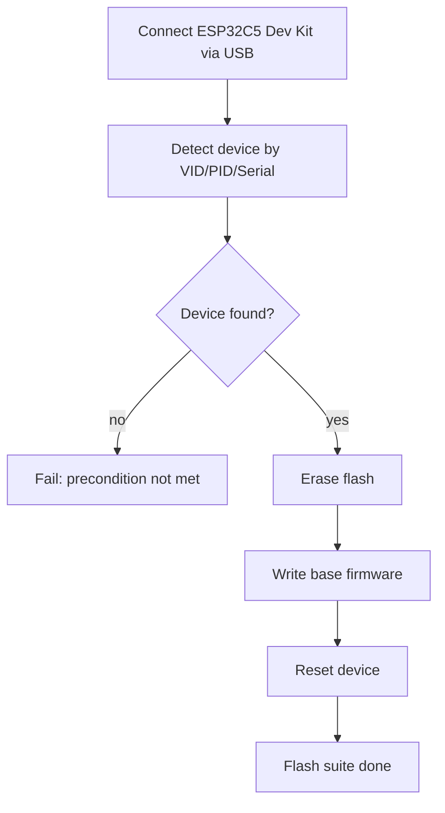

## Test flow (current suites)

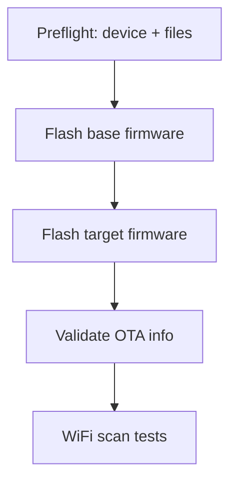

## Test suites

### Flash (mandatory)

1) `flash_base`  
   - Full erase + flash base firmware from `ESP32C5/tests/SW`
2) `flash_target`  
   - Full erase + flash target firmware from `ESP32C5/binaries-esp32c5`
3) `flash_validate`  
   - Wait for `BOARD READY`, send `ota_info`, validate OTA info output

#### Flash expectations

`flash_base`
- Does: erase + write base firmware.
- Pass: `esptool` succeeds, binaries present.
- Fail: missing files or `esptool` returns non-zero.

`flash_target`
- Does: erase + write target firmware.
- Pass: `esptool` succeeds, binaries present.
- Fail: missing files or `esptool` returns non-zero.

`flash_validate`
- Does: waits for `BOARD READY`, sends `ota_info`.
- Pass: output contains OTA info block (legacy or new format).
- Fail: missing OTA fields or no prompt response.

#### Flash flows

`flash_base`
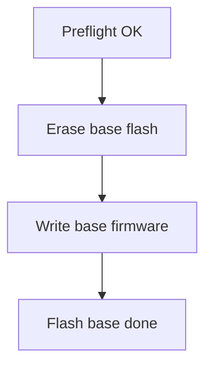

`flash_target`
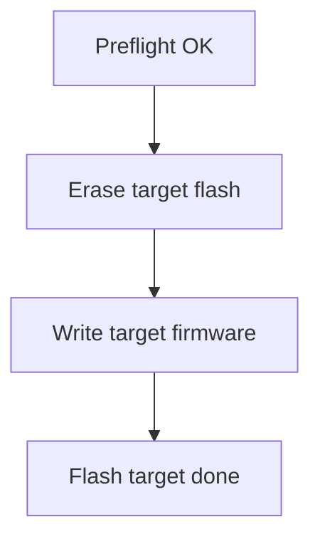

`flash_validate`
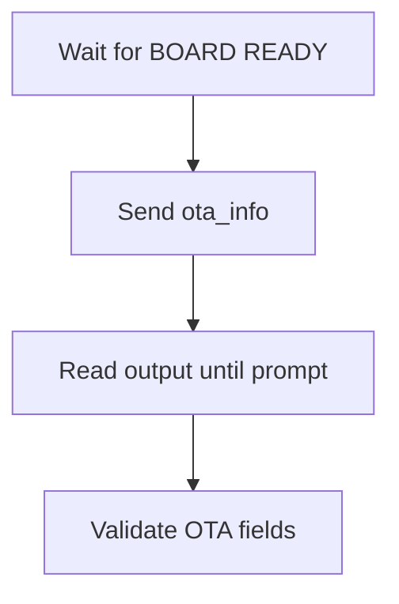

### Scan (mandatory)

1) `scan_networks_basic`  
   - Run `scan_networks`, verify summary/status and minimum networks
2) `scan_networks_repeatability`  
   - Run `scan_networks` N times, fail if variation > 25%
3) `show_scan_results_after_scan`  
   - Run `show_scan_results`, verify CSV-like output
4) `scan_channel_time_defaults`  
   - Set min/max, verify fewer networks at low times and more at higher max, then restore defaults
5) `scan_networks_timeout_guard`  
   - Ensure scan completes within timeout
6) `scan_networks_output_fields`  
   - Validate CSV rows have 8 fields
7) `vendor_toggle_affects_scan`  
   - Vendor on -> CSV has vendor names, vendor off -> CSV has no vendor names

#### Scan flows

`scan_networks_basic`
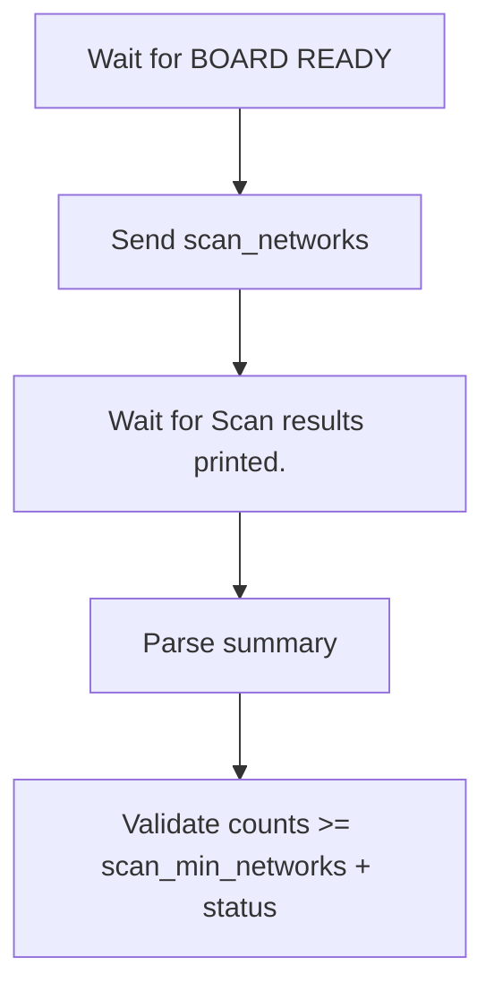

`scan_networks_basic` expectations
- Does: `vendor set on`, reboot, `scan_networks`.
- Pass: `Vendor file: available`, status=0, counts >= `scan_min_networks`.
- Fail: vendor not enabled, status != 0, or counts below minimum.

`scan_networks_repeatability`
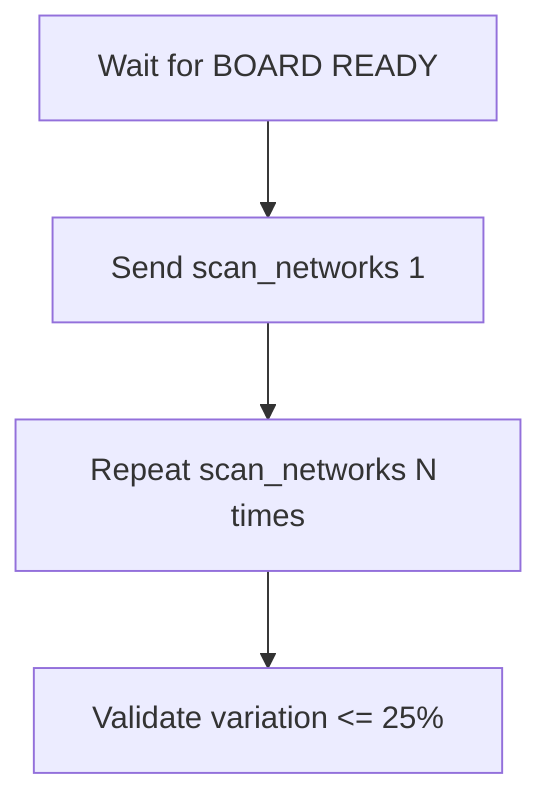

`scan_networks_repeatability` expectations
- Does: reboot before each scan, run N scans.
- Pass: each scan status=0 and counts >= `scan_min_networks`, variation <= `scan_repeat_max_variation_pct`.
- Fail: missing summary, status!=0, or variation too high.

`show_scan_results_after_scan`
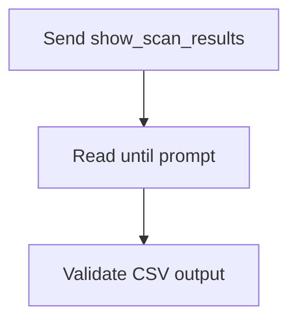

`show_scan_results_after_scan` expectations
- Does: reboot, `scan_networks`, then `show_scan_results`.
- Pass: CSV lines exist and count matches `Retrieved N`.
- Fail: no CSV output or count mismatch.

`scan_channel_time_defaults`
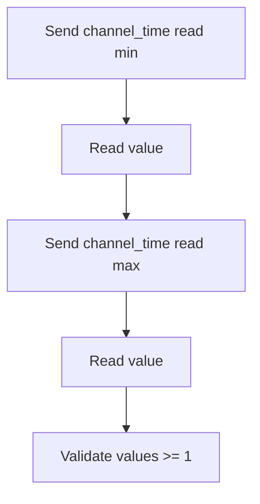

`scan_channel_time_defaults` expectations
- Does: set low min/max, scan; set higher max, scan; restore defaults and verify applied.
- Pass: higher max yields >= networks vs low, default log shows expected min/max.
- Fail: missing summary, status!=0, or counts not increasing.

`scan_networks_timeout_guard`
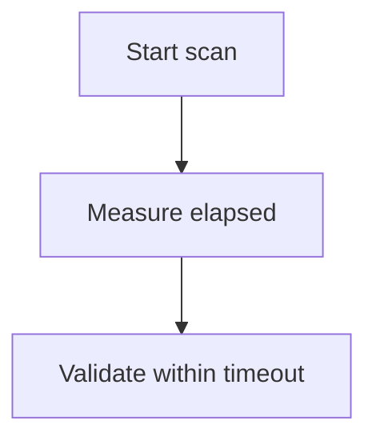

`scan_networks_timeout_guard` expectations
- Does: use timing from last scan.
- Pass: elapsed <= `scan_timeout` (+ small buffer).
- Fail: scan exceeds timeout.

`scan_networks_output_fields`
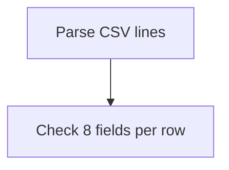

`scan_networks_output_fields` expectations
- Does: parse first CSV rows from `scan_networks`.
- Pass: each row has 8 fields and at least one vendor name present.
- Fail: wrong field count or no vendor names.

`vendor_toggle_affects_scan` expectations
- Does: vendor on + scan, vendor off + scan.
- Pass: vendor on -> at least one vendor name; vendor off -> no vendor names.
- Fail: vendor state not applied or vendor names present in off mode.

### System (mandatory)

1) `vendor_read`  
   - Run `vendor read`, verify vendor status output
2) `led_set_and_read`  
   - Toggle LED on/off and verify `led read` output
3) `list_sd`  
   - Run `list_sd`, verify SD is mounted and output is valid

#### System flows

`vendor_read`
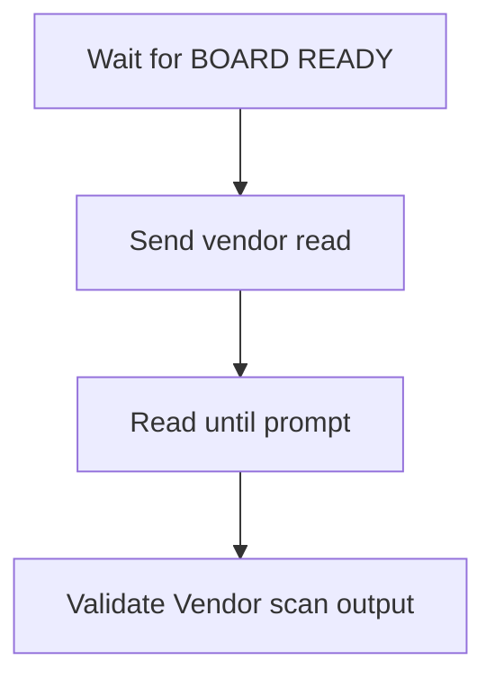

`vendor_read` expectations
- Does: `vendor read`, possibly `vendor set on`, then `vendor read`.
- Pass: `Vendor scan: on` and `Vendor file: available`.
- Fail: vendor not enabled or vendor file missing.

`led_set_and_read`
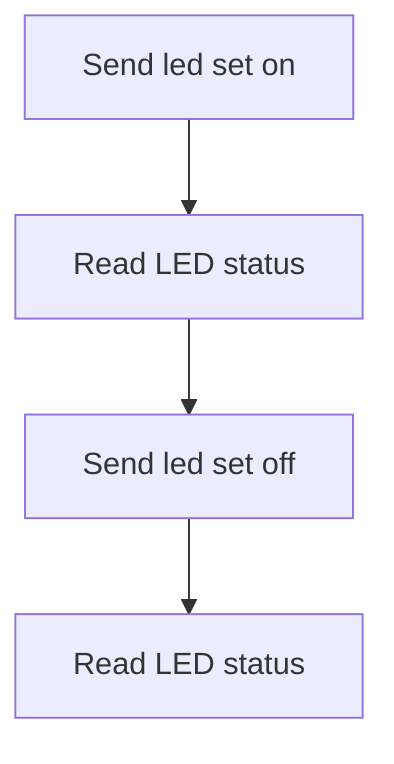

`led_set_and_read` expectations
- Does: set on, read; set level 1-5, read; set off, read.
- Pass: outputs reflect on/off and chosen level.
- Fail: output missing expected LED status or level.

`list_sd`
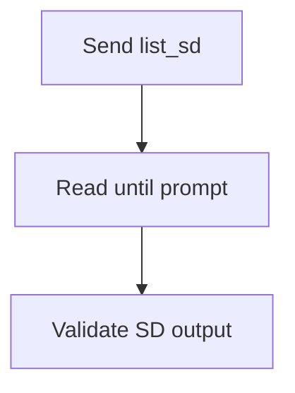

`list_sd` expectations
- Does: `list_sd`.
- Pass: no SD init error; either “No HTML files” or list of HTML files.
- Fail: SD init failure or unexpected output.

`select_html` expectations
- Does: `list_sd`, pick first index, run `select_html <index>`.
- Pass: “Loaded HTML file” + “Portal will now use this custom HTML.”
- Fail: missing index or missing success lines.

### BLE (mandatory)

1) `scan_bt`  
   - Run `scan_bt`, verify BLE scan summary output

#### BLE flow

`scan_bt`
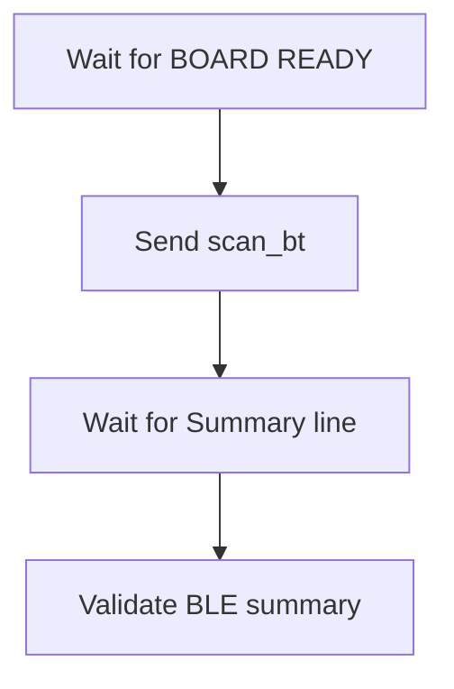

`scan_bt` expectations
- Does: `scan_bt` and wait for BLE summary.
- Pass: BLE scan header and Summary line present.
- Fail: missing summary or scan start output.

## Device configuration

Default detection uses `ESP32C5/tests/config/devices.json` and looks for a
single DUT device by VID/PID/serial. You can override with:

- `ESP32C5_DUT_PORT=/dev/ttyUSB0`
- `ESP32C5_DEVICES_CONFIG=/path/to/devices.json`

## Flash manifest

If base binaries or offsets differ, provide a manifest JSON and optional base
directory:

```json
{
  "files": [
    {"path": "bootloader.bin", "offset": "0x2000"},
    {"path": "partition-table.bin", "offset": "0x8000"},
    {"path": "projectZero.bin", "offset": "0x20000"}
  ]
}
```

Use it with:

```bash
ESP32C5_FLASH_MANIFEST=/workspace/ESP32C5/tests/flash_manifest.json \
ESP32C5_BASE_SW_DIR=/workspace/ESP32C5/tools/SW \
pytest -m flash
```
