# ESP32C5 tests

## Environment setup

1) Install host dependency for port auto-detection:
```bash
sudo apt install python3-serial
```
2) Find connected ports:
```bash
ls -l /dev/ttyUSB* /dev/ttyACM*
```
3) Update `ESP32C5/tests/config/devices.json` with correct `port` values.

### Debug console (manual)

Connect to a device to verify boot logs and CLI:

```bash
screen /dev/ttyUSB0 115200
# exit: Ctrl+A, then K, then Y
```

```bash
sudo minicom -D /dev/ttyUSB0 -b 115200
# help: Ctrl+A, then Z
# exit: Ctrl+A, then X
```

## Quick start (flash suite)

1) Put base firmware binaries into `ESP32C5/tools/SW/`:
   - `bootloader.bin`
   - `partition-table.bin`
   - `projectZero.bin`
2) Plug the ESP32C5 DUT (CP2102N) into USB.
3) Run with Docker Compose:

```bash
docker compose -f ESP32C5/tests/docker-compose.yml run --rm tests
```

## Regression suite

This suite is treated as a full regression gate after each commit. It validates
end-to-end device behavior over UART (flash, scan, system, BLE).

## Alternate runs

Run without pytest-sugar:
```bash
docker compose -f ESP32C5/tests/docker-compose.yml run --rm \
  -e ESP32C5_DUT_PORT=/dev/ttyUSB0 \
  -e PYTEST_ADDOPTS="-p no:sugar" \
  tests
```

Run with JanOSmini client (deauth/handshake tests):
```bash
docker compose -f ESP32C5/tests/docker-compose.yml run --rm \
  -e ESP32C5_DUT_PORT=/dev/ttyUSB0 \
  -e ESP32C5_CLIENT_JANOSMINI_PORT=/dev/ttyACM0 \
  -e ESP32C5_CLIENT_DEVICE=/dev/ttyACM0 \
  tests pytest -m deauth
```

Or use the helper script to auto-map ports from `devices.json`:
```bash
ESP32C5_DEVICES_CONFIG=ESP32C5/tests/config/devices.json \
ESP32C5/tests/run_tests.sh pytest -m deauth
```

Requires host dependency:
```bash
sudo apt install python3-serial
```

Generate HTML report:
```bash
docker compose -f ESP32C5/tests/docker-compose.yml run --rm \
  -e ESP32C5_DUT_PORT=/dev/ttyUSB0 \
  -e PYTEST_ADDOPTS="--html=/workspace/ESP32C5/tests/results/report.html --self-contained-html" \
  tests
```

## Results artifacts

After the run, the `results/` directory is packaged into a zip artifact named:
`results_YYYYMMDD_HHMMSS_<version>_<build>.zip` (version/build from `ota_info`).
All `.txt` and `.html` files are removed after zipping; only the zip remains.

The full pytest console output is saved as `pytest_raw.txt` and included in the
zip artifact.

On test start, old zip artifacts are moved to `results/archive/` and any loose
`.txt`/`.html` files are removed to keep the run clean.

### Artifact files

Common files included in the zip:
- `metadata.txt`, `ota_info.txt`
- `pytest_raw.txt`, `report.html`
- `flash_base.txt`, `flash_target.txt`
- `vendor.txt`, `scan_networks.txt`, `show_scan_results.txt`
- `scan_repeatability.txt`
- `scan_vendor_on.txt`, `scan_vendor_off.txt`
- `scan_channel_time_low.txt`, `scan_channel_time_high.txt`, `scan_channel_time_default.txt`
- `scan_timeout_guard.txt`, `scan_output_fields.txt`
- `channel_view.txt`, `list_probes.txt`
- `show_probes_vendor.txt`, `list_probes_vendor.txt`
- `show_sniffer_results.txt`, `show_sniffer_results_vendor.txt`, `clear_sniffer_results.txt`
- `sniffer_debug.txt`
- `sniffer_noscan.txt`
- `vendor_read.txt`, `vendor_persistence.txt`, `vendor_persistence_off.txt`
- `led_set_and_read.txt`, `list_sd.txt`, `select_html.txt`, `list_dir.txt`
- `scan_bt.txt`, `scan_airtag.txt`
- `show_scan_results_no_scan.txt`
- `show_scan_results_vendor.txt`, `show_scan_results_during_scan.txt`
- `deauth_scan.txt`, `deauth_select.txt`, `deauth_start.txt`, `deauth_stop.txt`
- `deauth_client_hold.txt`, `deauth_client_connect.txt`, `deauth_client_status.txt`
- `deauth_client_disconnect.txt`, `deauth_client_status_after.txt`
- `handshake_scan.txt`, `handshake_select.txt`, `handshake_start.txt`
- `handshake_list_dir.txt`, `handshake_delete.txt`
- `handshake_client_hold.txt`, `handshake_client_connect.txt`, `handshake_client_status.txt`
- `handshake_client_disconnect.txt`, `handshake_client_status_after.txt`

HTML report shows CLI logs inline under each test (expand the test row).

## After git pull (rebuild image)

If you pulled new changes, rebuild the test image before running:
```bash
docker compose -f ESP32C5/tests/docker-compose.yml build --no-cache tests && \
docker compose -f ESP32C5/tests/docker-compose.yml run --rm \
  -e ESP32C5_DUT_PORT=/dev/ttyUSB0 \
  -e PYTEST_ADDOPTS="--html=/workspace/ESP32C5/tests/results/report.html --self-contained-html" \
  tests
```

## Hardware

Primary test device (master):
- ESP32C5 Dev Kit with SD card attached
- Connected to Linux host via USB (CP2102N)

## Flow (current: flash)

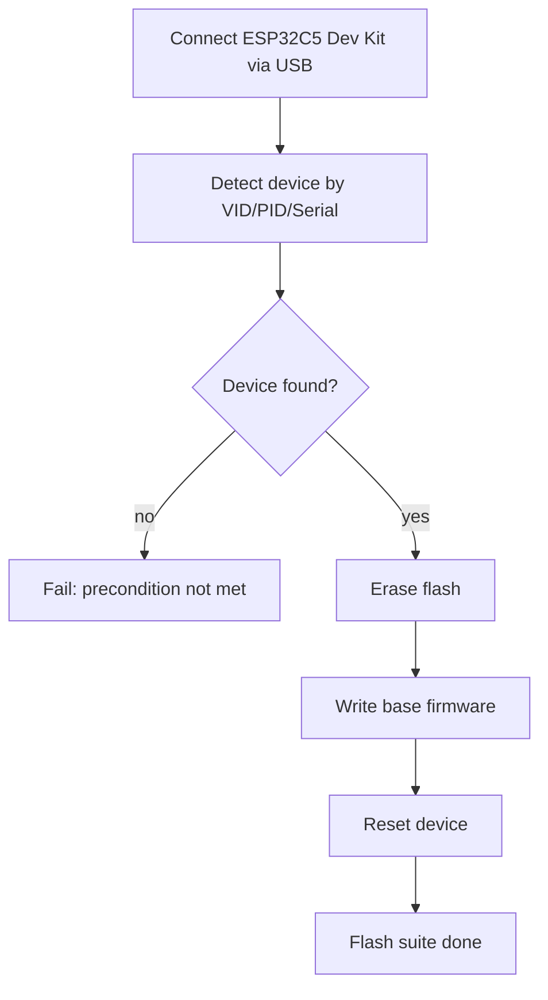

## Test flow (current suites)

```mermaid
flowchart TD
    A[Preflight: device + files] --> B[Flash base firmware]
    B --> C[Flash target firmware]
    C --> D[Validate OTA info]
    D --> E[WiFi scan tests]
    E --> F[Deauth tests]
    F --> G[Handshake tests]
    G --> H[System tests (vendor/LED/SD)]
    H --> I[BLE tests]
```

## Test suites

### Flash (mandatory)

1) `flash_base`  
   - Full erase + flash base firmware from `ESP32C5/tests/SW`
2) `flash_target`  
   - Full erase + flash target firmware from `ESP32C5/binaries-esp32c5`
3) `flash_validate`  
   - Wait for `BOARD READY`, send `ota_info`, validate OTA info output

#### Flash expectations

`flash_base`
- Does: erase + write base firmware.
- Pass: `esptool` succeeds, binaries present.
- Fail: missing files or `esptool` returns non-zero.

`flash_target`
- Does: erase + write target firmware.
- Pass: `esptool` succeeds, binaries present.
- Fail: missing files or `esptool` returns non-zero.

`flash_validate`
- Does: waits for `BOARD READY`, sends `ota_info`.
- Pass: output contains OTA info block (legacy or new format).
- Fail: missing OTA fields or no prompt response.

#### Flash flows

`flash_base`
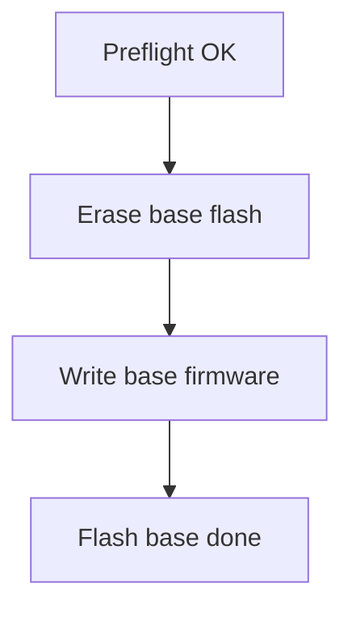

`flash_target`
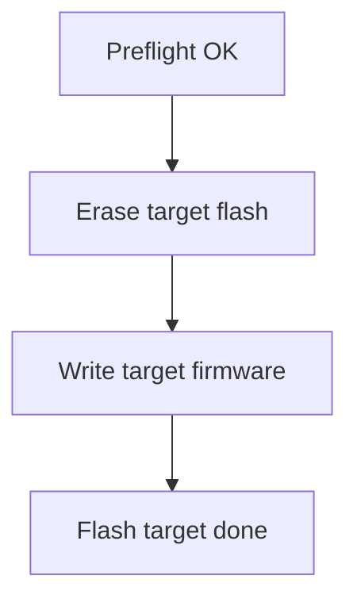

`flash_validate`
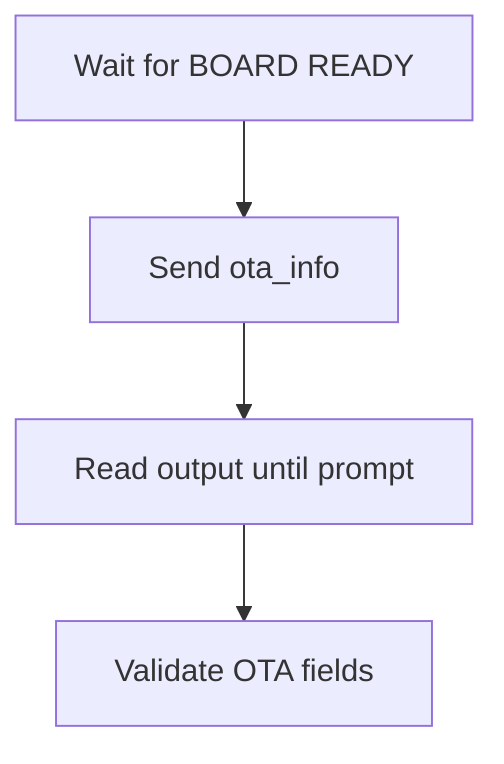

### Scan (mandatory)

1) `scan_networks_basic`  
   - Run `scan_networks`, verify summary/status and minimum networks
2) `scan_networks_repeatability`  
   - Run `scan_networks` N times (default 3), each must pass basic checks
3) `show_scan_results_after_scan`  
   - Run `show_scan_results`, verify CSV-like output
4) `scan_channel_time_defaults`  
   - Set min/max, verify fewer networks at low times and more at higher max, then restore defaults
5) `scan_networks_timeout_guard`  
   - Ensure scan completes within timeout
6) `scan_networks_output_fields`  
   - Validate CSV rows have 8 fields
7) `vendor_toggle_affects_scan`  
   - Vendor on -> CSV has vendor names, vendor off -> CSV has no vendor names
8) `channel_view`  
   - Run `channel_view`, validate output for ch6 and ch36, then stop
9) `list_probes_after_sniffer`  
   - Run `start_sniffer`, wait, stop, then `list_probes`
10) `show_probes_vendor_after_sniffer`  
   - Run `start_sniffer`, wait, stop, then `show_probes_vendor`
11) `list_probes_vendor_after_sniffer`  
   - Run `start_sniffer`, wait, stop, then `list_probes_vendor`
12) `show_sniffer_results_and_clear`  
   - Run `start_sniffer`, wait, stop, then `show_sniffer_results`, `clear_sniffer_results`
13) `show_scan_results_without_scan`  
   - Run `show_scan_results` after reboot (no scan), expect no-scan message
14) `show_sniffer_results_vendor`  
   - Run `start_sniffer`, wait, stop, then `show_sniffer_results_vendor`
15) `sniffer_debug_toggle`  
   - Toggle `sniffer_debug 1` then `sniffer_debug 0`
16) `show_scan_results_vendor_after_scan`  
   - Run `scan_networks`, then `show_scan_results` and verify vendor names
17) `show_scan_results_during_scan`  
   - Run `scan_networks`, query `show_scan_results` while scan is in progress
18) `start_sniffer_noscan`  
   - Start sniffer without scan and stop

#### Scan flows

`scan_networks_basic`
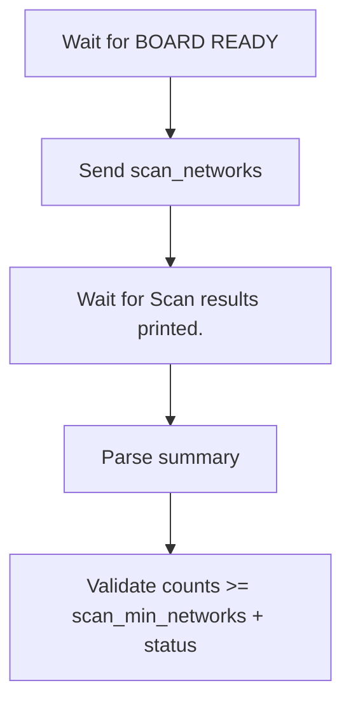

`scan_networks_basic` expectations
- Does: `vendor set on`, reboot, `scan_networks`.
- Pass: `Vendor file: available`, status=0, counts >= `scan_min_networks`.
- Fail: vendor not enabled, status != 0, or counts below minimum.

`scan_networks_repeatability`
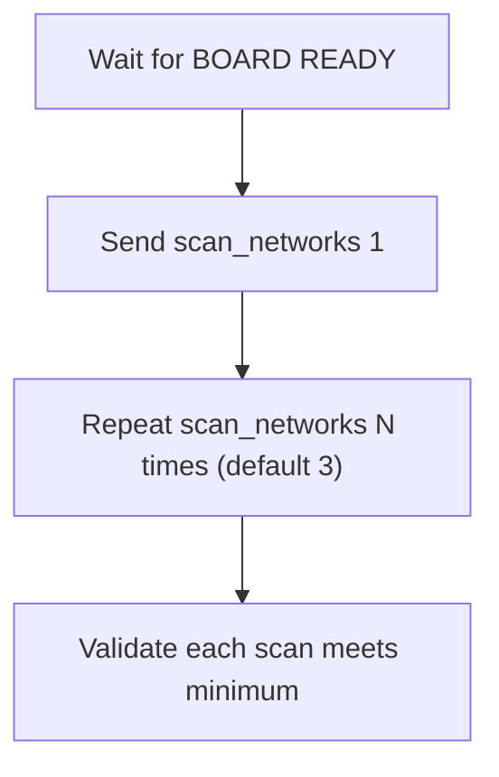

`scan_networks_repeatability` expectations
- Does: reboot before each scan, run N scans.
- Pass: each scan status=0 and counts >= `scan_min_networks`.
- Fail: missing summary or status!=0 or counts below minimum.

`show_scan_results_after_scan`
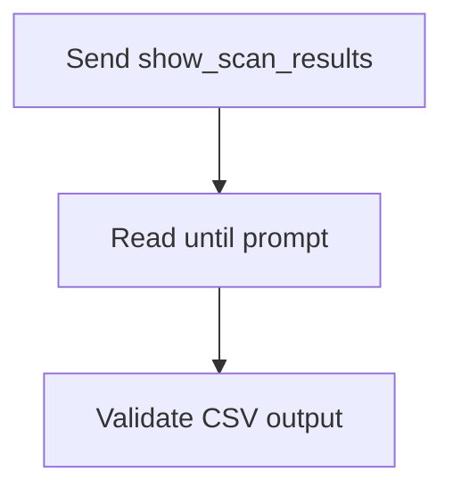

`show_scan_results_after_scan` expectations
- Does: reboot, `scan_networks`, then `show_scan_results`.
- Pass: CSV lines exist and count matches `Retrieved N`.
- Fail: no CSV output or count mismatch.

`show_scan_results_without_scan`
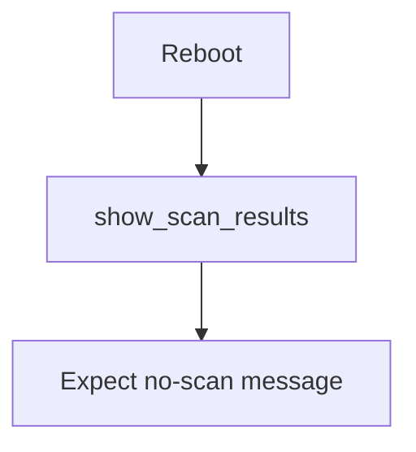

`show_scan_results_without_scan` expectations
- Does: reboot and run `show_scan_results` before any scan.
- Pass: output contains "No scan has been performed yet."
- Fail: missing no-scan message.

`show_scan_results_vendor_after_scan`
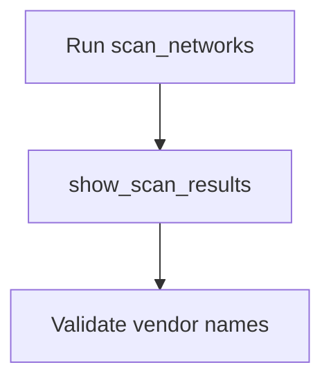

`show_scan_results_vendor_after_scan` expectations
- Does: `vendor set on`, `scan_networks`, then `show_scan_results`.
- Pass: output includes vendor names in CSV column 3.
- Fail: no CSV output or vendor names missing.

`show_scan_results_during_scan`
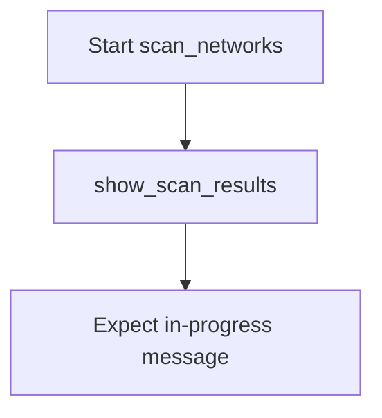

`show_scan_results_during_scan` expectations
- Does: start `scan_networks`, call `show_scan_results` while scan is running.
- Pass: output contains "Scan still in progress".
- Fail: missing in-progress message.

`scan_channel_time_defaults`
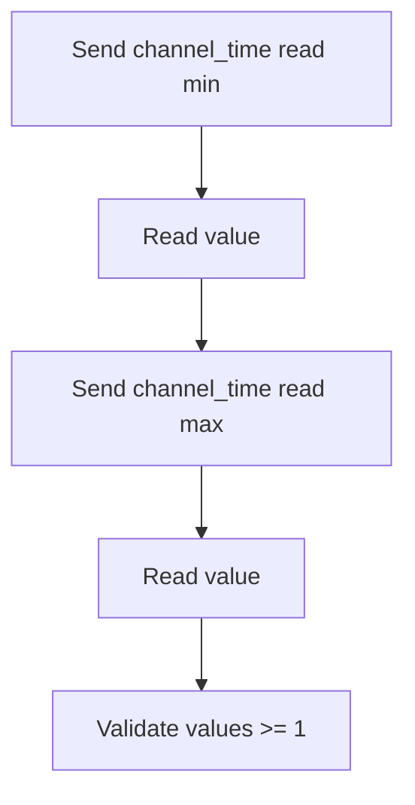

`scan_channel_time_defaults` expectations
- Does: set low min/max, scan; set higher max, scan; restore defaults and verify applied.
- Pass: higher max yields >= networks vs low, default log shows expected min/max.
- Fail: missing summary, status!=0, or counts not increasing.

`scan_networks_timeout_guard`
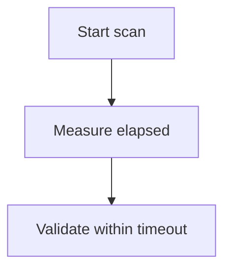

`scan_networks_timeout_guard` expectations
- Does: use timing from last scan.
- Pass: elapsed <= `scan_timeout` (+ small buffer).
- Fail: scan exceeds timeout.

`scan_networks_output_fields`
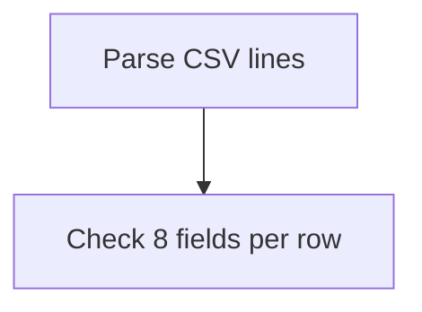

`scan_networks_output_fields` expectations
- Does: parse first CSV rows from `scan_networks`.
- Pass: each row has 8 fields and at least one vendor name present.
- Fail: wrong field count or no vendor names.

`vendor_toggle_affects_scan` expectations
- Does: vendor on + scan, vendor off + scan.
- Pass: vendor on -> at least one vendor name; vendor off -> no vendor names.
- Fail: vendor state not applied or vendor names present in off mode.

`channel_view` expectations
- Does: run `channel_view`, wait for start/end markers, then `stop`.
- Pass: output contains `channel_view_start`, `channel_view_end`, `ch6:`, `ch36:`.
- Fail: missing markers or channels.

`list_probes_after_sniffer` expectations
- Does: `start_sniffer`, wait until `sniffer_min_packets` (or timeout), `stop`, then `list_probes`.
- Pass: at least `probes_min_entries` probe entries and sniffer reached `sniffer_min_packets`.
- Fail: "No probe requests captured", too few entries, or packet minimum not reached.

`show_probes_vendor_after_sniffer`
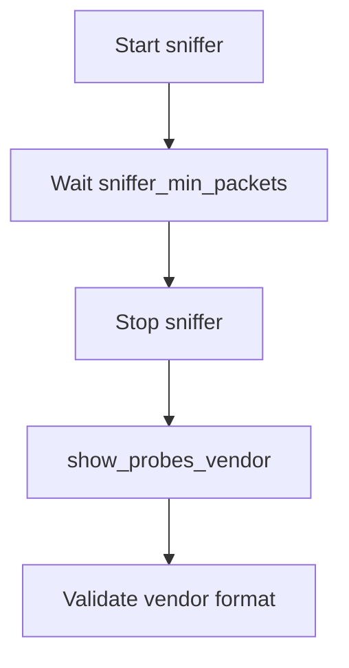

`list_probes_vendor_after_sniffer`
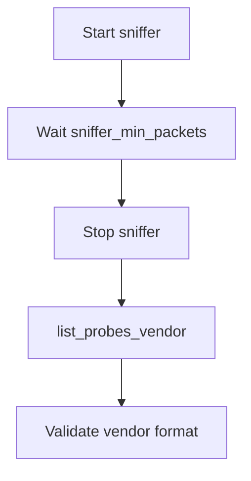

`show_sniffer_results_and_clear`
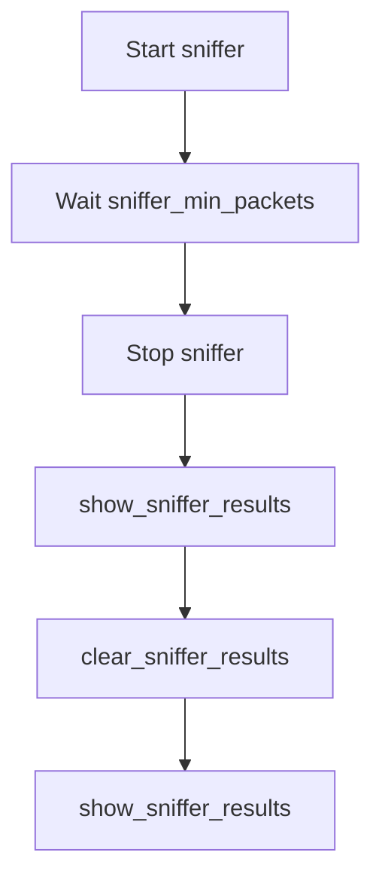

`show_probes_vendor_after_sniffer` expectations
- Does: `vendor set on`, `start_sniffer`, wait until `sniffer_min_packets` (or timeout), `stop`, then `show_probes_vendor`.
- Pass: at least one line includes MAC and vendor `[Vendor]` and packet minimum reached.
- Fail: "No probe requests captured", missing vendor format, or packet minimum not reached.

`list_probes_vendor_after_sniffer` expectations
- Does: `vendor set on`, `start_sniffer`, wait until `sniffer_min_packets` (or timeout), `stop`, then `list_probes_vendor`.
- Pass: at least `probes_min_entries` entries with `[Vendor]` and packet minimum reached.
- Fail: "No probe requests captured", missing vendor format, or packet minimum not reached.

`show_sniffer_results_and_clear` expectations
- Does: `start_sniffer`, wait until `sniffer_min_packets` (or timeout), `stop`, `show_sniffer_results`, then `clear_sniffer_results`.
- Pass: `show_sniffer_results` returns data, packet minimum reached, and clear confirms "Sniffer results cleared." then shows no data.
- Fail: no sniffer data, packet minimum not reached, or clear did not reset results.

`show_sniffer_results_vendor`
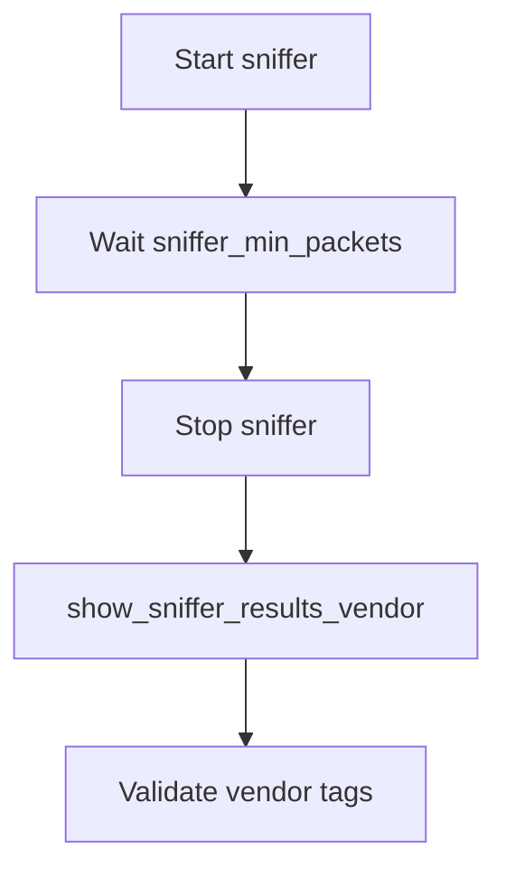

`show_sniffer_results_vendor` expectations
- Does: `vendor set on`, `start_sniffer`, wait until `sniffer_min_packets`, then `show_sniffer_results_vendor`.
- Pass: output includes vendor tags in brackets.
- Fail: missing vendor tags or packet minimum not reached.

`sniffer_debug_toggle` expectations
- Does: `sniffer_debug 1`, then `sniffer_debug 0`.
- Pass: outputs include "ENABLED" and "DISABLED".
- Fail: toggle output missing.

`start_sniffer_noscan` expectations
- Does: `start_sniffer_noscan`, then `stop`.
- Pass: output shows sniffer monitoring and stop confirmation.
- Fail: missing start or stop output.

### Deauth (mandatory)

1) `deauth_disconnects_client`  
   - Client connects to `target_ap`, DUT runs `scan_networks` → `select_networks` → `start_deauth`, verify disconnect/reconnect

#### Deauth flow

`deauth_disconnects_client`
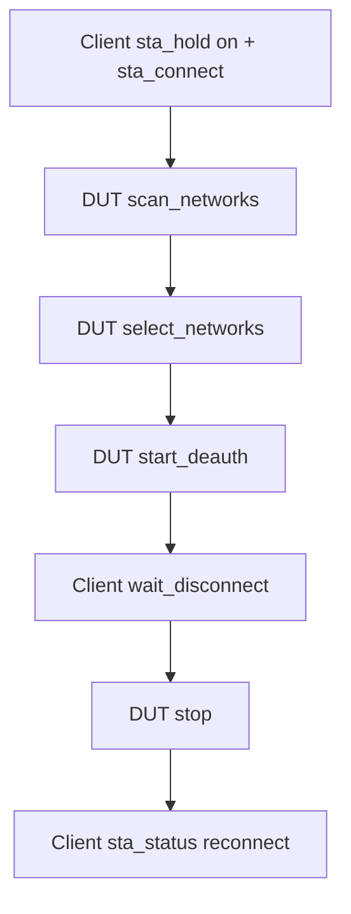

`deauth_disconnects_client` expectations
- Does: client connects to `target_ap`, DUT starts deauth after scan+select.
- Pass: client disconnects and reconnects after stop.
- Fail: no disconnect or no reconnect.

### Handshake (mandatory)

1) `handshake_capture_selected`  
   - Run `scan_networks`, select `target_ap`, start `start_handshake` and wait for capture

#### Handshake flow

`handshake_capture_selected`
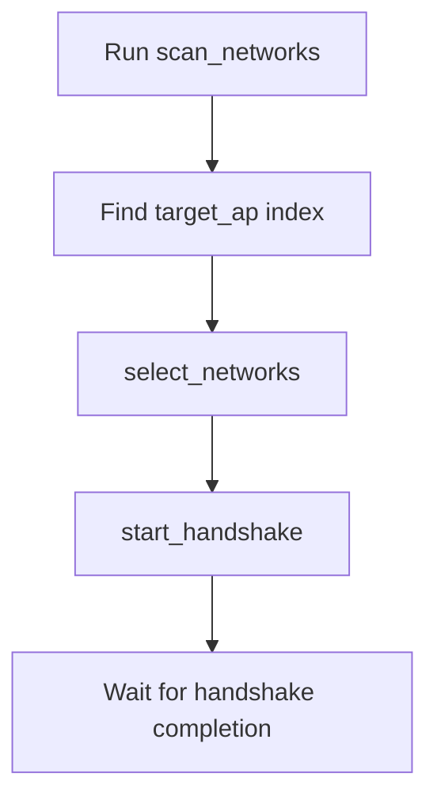

`handshake_capture_selected` expectations
- Does: client connects to `target_ap`, DUT scans/selects then runs `start_handshake`, then delete saved `.pcap`/`.hccapx` from SD.
- Pass: output contains "HANDSHAKE IS COMPLETE AND VALID" (or "Handshake #1 captured"/"All selected networks captured"), saved paths found, files removed, client reconnects.
- Fail: target AP not found in scan output, "SAVE FAILED", missing saved paths, delete verification fails, or client does not reconnect.

### System (mandatory)

1) `vendor_read`  
   - Run `vendor read`, verify vendor status output
2) `led_set_and_read`  
   - Toggle LED on/off and verify `led read` output
3) `list_sd`  
   - Run `list_sd`, verify SD is mounted and output is valid
4) `select_html`  
   - Pick a file from `list_sd` and load it with `select_html`
5) `vendor_persistence`  
   - Enable vendor scan, reboot, and verify it stays on
6) `vendor_persistence_off`  
   - Disable vendor scan, reboot, and verify it stays off
7) `list_dir`  
   - List a configured SD directory and verify output

#### System flows

`vendor_read`
```mermaid
flowchart TD
    A[Wait for BOARD READY] --> B[Send vendor read]
    B --> C[Read until prompt]
    C --> D[Validate Vendor scan output]
```

`vendor_read` expectations
- Does: `vendor read`, possibly `vendor set on`, then `vendor read`.
- Pass: `Vendor scan: on` and `Vendor file: available`.
- Fail: vendor not enabled or vendor file missing.

`led_set_and_read`
```mermaid
flowchart TD
    A[Send led set on] --> B[Read LED status]
    B --> C[Send led set off]
    C --> D[Read LED status]
```

`led_set_and_read` expectations
- Does: set on, read; set level 1-5, read; set off, read.
- Pass: outputs reflect on/off and chosen level.
- Fail: output missing expected LED status or level.

`list_sd`
```mermaid
flowchart TD
    A[Send list_sd] --> B[Read until prompt]
    B --> C[Validate SD output]
```

`vendor_persistence`
```mermaid
flowchart TD
    A[Send vendor set on] --> B[Reboot]
    B --> C[Send vendor read]
    C --> D[Validate vendor stays on]
```

`vendor_persistence_off`
```mermaid
flowchart TD
    A[Send vendor set off] --> B[Reboot]
    B --> C[Send vendor read]
    C --> D[Validate vendor stays off]
```

`list_dir`
```mermaid
flowchart TD
    A[Send list_dir] --> B[Read until prompt]
    B --> C[Validate output]
```

`list_sd` expectations
- Does: `list_sd`.
- Pass: no SD init error; either “No HTML files” or list of HTML files.
- Fail: SD init failure or unexpected output.

`select_html` expectations
- Does: `list_sd`, pick first index, run `select_html <index>`.
- Pass: “Loaded HTML file” + “Portal will now use this custom HTML.”
- Fail: missing index or missing success lines.

`vendor_persistence` expectations
- Does: `vendor set on`, reboot, then `vendor read`.
- Pass: vendor remains enabled and vendor file is available.
- Fail: vendor resets to off or vendor file missing.

`vendor_persistence_off` expectations
- Does: `vendor set off`, reboot, then `vendor read`.
- Pass: vendor remains disabled.
- Fail: vendor shows enabled after reboot.

`list_dir` expectations
- Does: `list_dir <path>`.
- Pass: output contains "Files in".
- Fail: list_dir command fails or missing output.

### BLE (mandatory)

1) `scan_bt`  
   - Run `scan_bt`, verify BLE scan summary output
2) `scan_airtag`  
   - Run `scan_airtag`, read N samples, then `stop`

#### BLE flow

`scan_bt`
```mermaid
flowchart TD
    A[Wait for BOARD READY] --> B[Send scan_bt]
    B --> C[Wait for Summary line]
    C --> D[Validate BLE summary]
```

`scan_airtag`
```mermaid
flowchart TD
    A[Wait for BOARD READY] --> B[Send scan_airtag]
    B --> C[Read N samples]
    C --> D[Send stop]
    D --> E[Validate samples]
```

`scan_bt` expectations
- Does: `scan_bt` and wait for BLE summary.
- Pass: BLE scan header and Summary line present.
- Fail: missing summary or scan start output.

`scan_airtag` expectations
- Does: `scan_airtag`, read `airtag_poll_count` samples, then `stop`.
- Pass: at least one sample line like `0,2` is received.
- Fail: no samples or no stop confirmation.

## Device configuration

Default detection uses `ESP32C5/tests/config/devices.json` and looks for a
single DUT device by VID/PID/serial. You can override with:

- `ESP32C5_DUT_PORT=/dev/ttyUSB0`
- `ESP32C5_DEVICES_CONFIG=/path/to/devices.json`

### Find device serial (Linux)

```bash
python -m serial.tools.list_ports -v
```

Look for your CP2102N device and copy the `SerialNumber` into `devices.json`.

### devices.json schema

```json
{
  "devices": {
    "dut": {"vid": "10c4", "pid": "ea60", "serial": "...", "port": "/dev/ttyUSB0" },
    "clients": [
      {"name": "client1", "role": "test_unit", "vid": "10c4", "pid": "ea60", "serial": "...", "mac": "...", "port": "/dev/ttyACM0"},
      {"name": "client2", "role": "test_unit", "vid": "10c4", "pid": "ea60", "serial": "...", "mac": "...", "port": "/dev/ttyACM1"},
      {"name": "client_bt", "mac": "5E:A4:1F:54:AA:2B", "name_hint": "SHIELD"}
    ]
  },
  "target_ap": {"ssid": "HackMyMyBoy", "bssid": "AA:BB:CC:DD:EE:FF", "ip": "192.168.1.1", "password": "..." },
  "settings": {
    "flash_baud": 460800,
    "uart_baud": 115200,
    "sniffer_min_packets": 600,
    "sniffer_wait_seconds": 0,
    "ble_min_devices": 1,
    "list_dir_path": "lab",
    "handshake_timeout": 180,
    "client_prompt": "JanOSmini>",
    "client_disconnect_timeout": 20,
    "client_reconnect_timeout": 20
  }
}
```

Naming for clients: use `client1`, `client2`, etc. Add MAC addresses now if
you plan to validate client behavior later.
`port` can be set to a fixed `/dev/tty*` path to bypass auto-detection.
`role` can be used to describe the client purpose (for example `test_unit`).

`sniffer_min_packets` is the minimum packet count required before probe/sniffer
results are queried. `sniffer_wait_seconds` is the maximum wait time for
reaching that count; set `0` to wait until the packet count is reached.
`ble_min_devices` is the minimum BLE device count required in `scan_bt`.
`list_dir_path` defines the SD directory to list in the `list_dir` test.
`handshake_timeout` sets the maximum time to wait for `start_handshake` to finish.
`client_prompt` is the JanOSmini console prompt. `client_disconnect_timeout` and
`client_reconnect_timeout` control client wait windows.

## Flash manifest

If base binaries or offsets differ, provide a manifest JSON and optional base
directory:

```json
{
  "files": [
    {"path": "bootloader.bin", "offset": "0x2000"},
    {"path": "partition-table.bin", "offset": "0x8000"},
    {"path": "projectZero.bin", "offset": "0x20000"}
  ]
}
```

Use it with:

```bash
ESP32C5_FLASH_MANIFEST=/workspace/ESP32C5/tests/flash_manifest.json \
ESP32C5_BASE_SW_DIR=/workspace/ESP32C5/tools/SW \
pytest -m flash
```
