# ESP32C5 tests

## Quick start (flash suite)

1) Put base firmware binaries into `ESP32C5/tools/SW/`:
   - `bootloader.bin`
   - `partition-table.bin`
   - `projectZero.bin`
2) Plug the ESP32C5 DUT (CP2102N) into USB.
3) Run with Docker Compose:

```bash
docker compose -f ESP32C5/tests/docker-compose.yml run --rm tests
```

## Alternate runs

Run without pytest-sugar:
```bash
docker compose -f ESP32C5/tests/docker-compose.yml run --rm \
  -e ESP32C5_DUT_PORT=/dev/ttyUSB0 \
  -e PYTEST_ADDOPTS="-p no:sugar" \
  tests
```

Generate HTML report:
```bash
docker compose -f ESP32C5/tests/docker-compose.yml run --rm \
  -e ESP32C5_DUT_PORT=/dev/ttyUSB0 \
  -e PYTEST_ADDOPTS="--html=/workspace/ESP32C5/tests/results/report.html --self-contained-html" \
  tests
```

## Hardware

Primary test device (master):
- ESP32C5 Dev Kit with SD card attached
- Connected to Linux host via USB (CP2102N)

## Flow (current: flash)

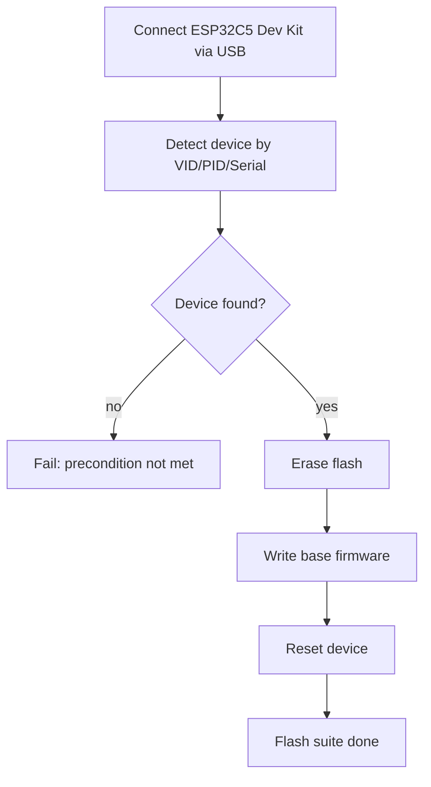

## Test flow (current suites)

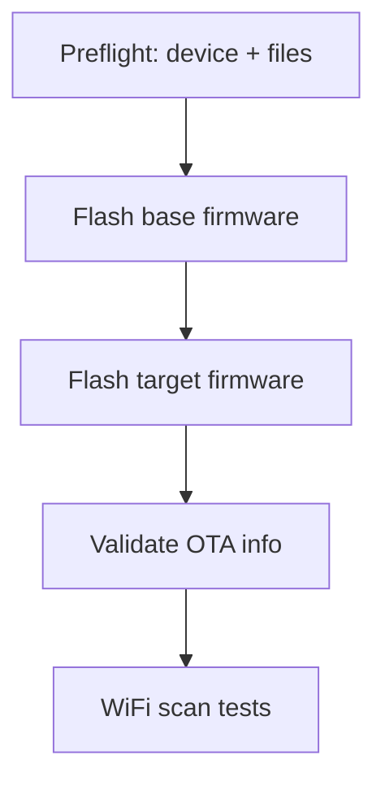

## Test suites

### Flash (mandatory)

1) `flash_base`  
   - Full erase + flash base firmware from `ESP32C5/tests/SW`
2) `flash_target`  
   - Full erase + flash target firmware from `ESP32C5/binaries-esp32c5`
3) `flash_validate`  
   - Wait for `BOARD READY`, send `ota_info`, validate OTA info output

#### Flash flows

`flash_base`
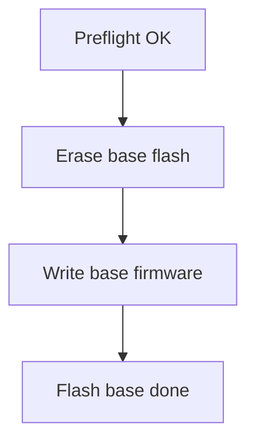

`flash_target`
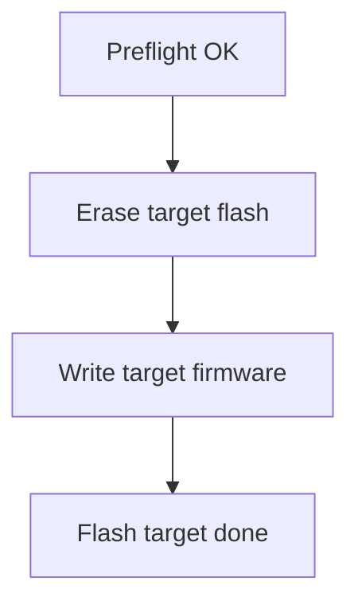

`flash_validate`
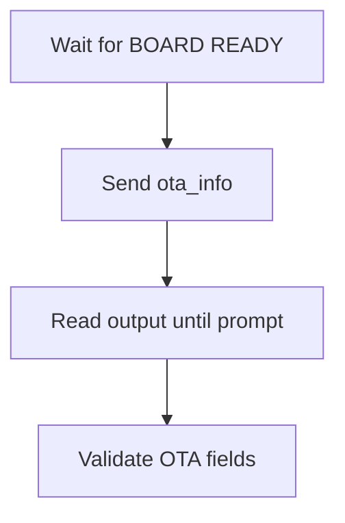

### Scan (mandatory)

1) `scan_networks_basic`  
   - Run `scan_networks`, verify summary and status
2) `scan_networks_repeatability`  
   - Run `scan_networks` twice, both must pass basic checks
3) `show_scan_results_after_scan`  
   - Run `show_scan_results`, verify CSV-like output
4) `scan_channel_time_defaults`  
   - Run `channel_time read min/max`, verify values >= 1
5) `scan_networks_timeout_guard`  
   - Ensure scan completes within timeout
6) `scan_networks_output_fields`  
   - Validate CSV rows have 8 fields

#### Scan flows

`scan_networks_basic`
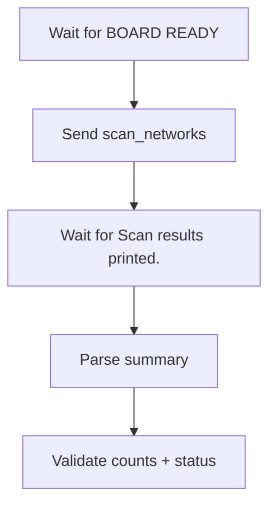

`scan_networks_repeatability`
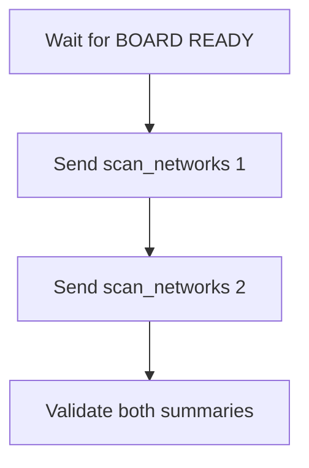

`show_scan_results_after_scan`
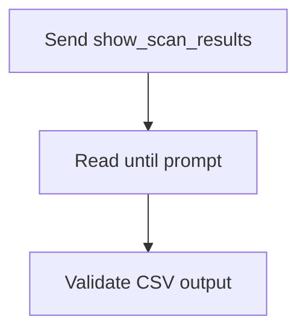

`scan_channel_time_defaults`
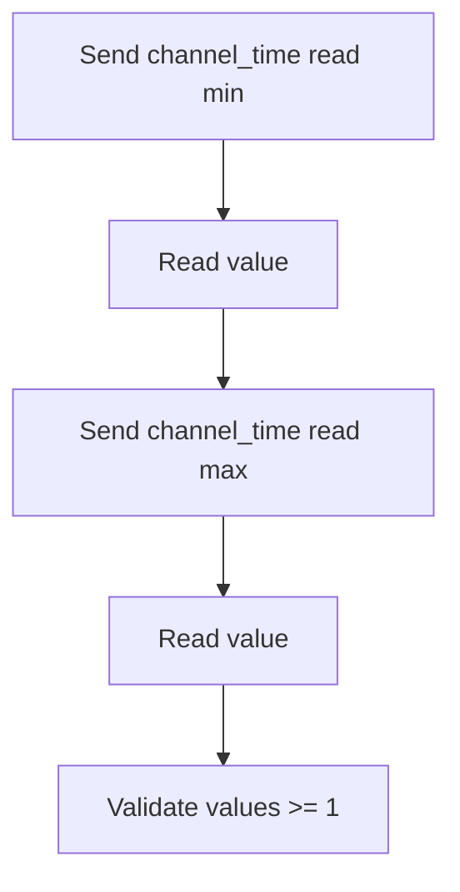

`scan_networks_timeout_guard`
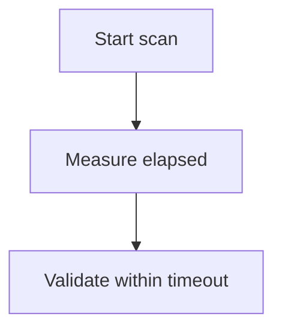

`scan_networks_output_fields`
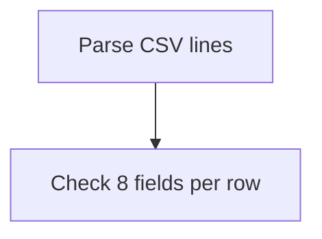

### System (mandatory)

1) `vendor_read`  
   - Run `vendor read`, verify vendor status output
2) `led_set_and_read`  
   - Toggle LED on/off and verify `led read` output
3) `list_sd`  
   - Run `list_sd`, verify SD is mounted and output is valid

#### System flows

`vendor_read`
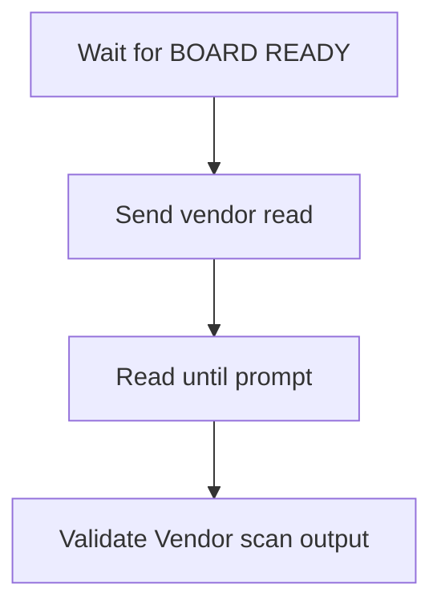

`led_set_and_read`
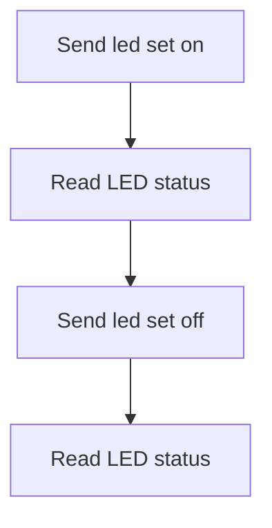

`list_sd`
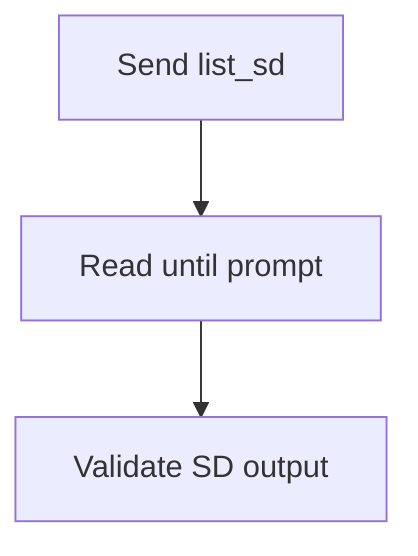

### BLE (mandatory)

1) `scan_bt`  
   - Run `scan_bt`, verify BLE scan summary output

#### BLE flow

`scan_bt`
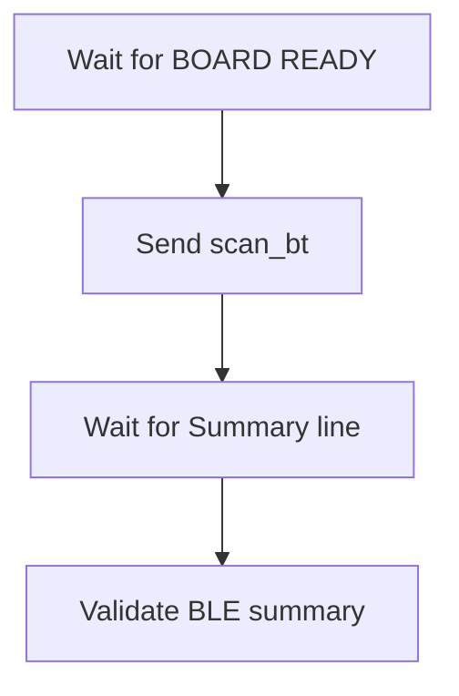

## Device configuration

Default detection uses `ESP32C5/tests/config/devices.json` and looks for a
single DUT device by VID/PID/serial. You can override with:

- `ESP32C5_DUT_PORT=/dev/ttyUSB0`
- `ESP32C5_DEVICES_CONFIG=/path/to/devices.json`

## Flash manifest

If base binaries or offsets differ, provide a manifest JSON and optional base
directory:

```json
{
  "files": [
    {"path": "bootloader.bin", "offset": "0x2000"},
    {"path": "partition-table.bin", "offset": "0x8000"},
    {"path": "projectZero.bin", "offset": "0x20000"}
  ]
}
```

Use it with:

```bash
ESP32C5_FLASH_MANIFEST=/workspace/ESP32C5/tests/flash_manifest.json \
ESP32C5_BASE_SW_DIR=/workspace/ESP32C5/tools/SW \
pytest -m flash
```
